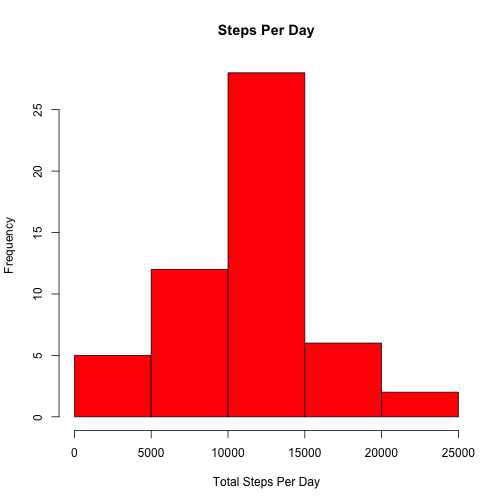
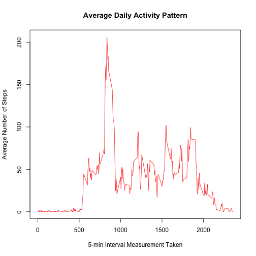

 
## Section 1: Loading and preprocessing the data

```r
library(dplyr)
library(lattice)
activity <- read.csv("activity.csv", header = TRUE, nrows = 10)
classes <- sapply(activity, class)
classes[c(1,3)] <- 'integer'
classes[2] <- 'Date'
activity <- read.csv("activity.csv", header = TRUE, colClasses = classes)
```

Now we generate the data for the total number of steps per day:

```r
data <- complete.cases(activity)
activity <- activity[data,]
aSum <- summarise(group_by(activity, date), sum(steps))
names(aSum) <- c("date", "steps")
```
Next we'll create a histogram of the total steps per day:

```r
myXlab = "Total Steps Per Day"
hist(aSum$steps, main = "Steps Per Day", xlab = myXlab, col = "red")
```

 

Here we find the mean and median total daily steps respectively:

```r
mean(aSum$steps)
```

```
## [1] 10766.19
```

```r
median(aSum$steps)
```

```
## [1] 10765
```
## Section 2: What is the average daily activity pattern?

```r
aMean <- summarise(group_by(activity, interval), mean(steps))
names(aMean) <- c("interval", "steps")
myXlab = "5-min Interval Measurement Taken"
myYlab = "Average Number of Steps"
myMain = "Average Daily Activity Pattern"
plot(aMean$interval, aMean$steps, type = "l", main = myMain, xlab = myXlab,
    ylab = myYlab, col = "red")
```

 

The 5-minute interval with the maximum steps was:

```r
aMean <- arrange(aMean, desc(steps))
aMean[1,1]
```

```
## Source: local data frame [1 x 1]
## 
##   interval
## 1      835
```
## Section 3: Imputing missing values

Now let's find the total number of NA rows in the dataset:

```r
activity <- read.csv("activity.csv", header = TRUE, colClasses = classes)
activityNAs <- summary(activity)
activityNAs[7,1]
```

```
## [1] "NA's   :2304  "
```
The missing values (those with NA) will be filled in with a mean for that 5-minute interval in a new dataset.

```r
createStepsClean = TRUE
for (i in 1:17568) {
    if (is.na(activity[i,1]) == TRUE) {
        intervalSteps <- subset(activity, interval == activity[i,3])
        intervalSteps <- intervalSteps[,1]
        intervalSteps <- intervalSteps[!is.na(intervalSteps)]
        if (createStepsClean == TRUE) {
            stepsClean <- mean(intervalSteps)
            createStepsClean = FALSE
        } else {
            stepsClean <- c(stepsClean, mean(intervalSteps))
        }
    } else {
        if (createStepsClean == TRUE) {
            stepsClean <- as.integer(activity[i,1])
            createStepsClean = FALSE
        } else {
            stepsClean <- c(stepsClean, as.integer(activity[i,1]))
        }
    }
}
activityClean <- cbind(stepsClean, activity[,2:3])
summary(activityClean)
```

```
##    stepsClean          date               interval     
##  Min.   :  0.00   Min.   :2012-10-01   Min.   :   0.0  
##  1st Qu.:  0.00   1st Qu.:2012-10-16   1st Qu.: 588.8  
##  Median :  0.00   Median :2012-10-31   Median :1177.5  
##  Mean   : 37.38   Mean   :2012-10-31   Mean   :1177.5  
##  3rd Qu.: 27.00   3rd Qu.:2012-11-15   3rd Qu.:1766.2  
##  Max.   :806.00   Max.   :2012-11-30   Max.   :2355.0
```

Now we'll make a histogram of the total number of steps taken each day...

```r
acSum <- summarize(group_by(activityClean, date), sum(stepsClean))
names(acSum) <- c("date","steps")
hist(acSum$steps, main = "Steps Per Day", xlab = "", col = "blue")
```

 

Now let's look at the mean and median of the new cleaned dataset respectively.

```r
mean(acSum$steps)
```

```
## [1] 10766.19
```

```r
median(acSum$steps)
```

```
## [1] 10766.19
```
One can compare this mean and median to the uncleaned dataset to see the mean is not effected but the median increases slightly.

## Section 4: Differences in activity patterns between weekdays and weekends

Here we will create a variable of the date being a weekday or weekend.

```r
for (i in 1:17568) {
    dayName <- as.character(weekdays(activityClean[i,2]))
    if ((dayName == "Saturday") | (dayName == "Sunday")) {
        day <- "weekend"
    } else {
        day <- "weekday"
    }
    if (exists("dayTypes") == FALSE) {
        dayTypes <- day
    } else {
        dayTypes <- c(dayTypes, day)
    }
}
activityClean$dayTypes <- dayTypes
activityClean <- transform(activityClean, dayTypes = factor(dayTypes))
```

Now we will make a panel plot which looks at average steps taken accross the intervals and compares weekends to weekdays.

```r
acSumDay <- summarize(group_by(activityClean, interval, dayTypes), 
                      mean(stepsClean))
names(acSumDay) <- c("interval","dayTypes","steps")
xyplot(steps ~ interval | dayTypes,
       data = acSumDay, layout = c(1, 2), type = "l",
       xlab = "5-min Interval", ylab = "Average Steps")
```

 


